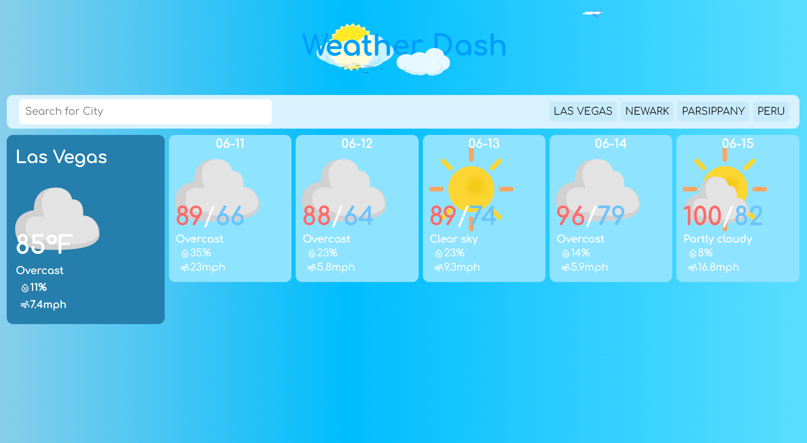

# Weather-App


https://sergrojas29.github.io/Weather-App/

Weather Dash my first mobile freindly webapp. It will provides you with current weather information for any location in the world. Just write a location city or country and it will present a current forcast and a five day forcast of the average temperature. Along with saving the previous search to clickable links.

Along with mobile site, it also has an auto complete search function.


## Authors

-[@Sergrojas29](https://github.com/Sergrojas29) | Sergio Rojas-Aguilar


## API

| API | Type     | Description                |
| :-------- | :------- | :------------------------- |
| [Open-meteo](https://open-meteo.com/) | `data` | Search locations globally in any language|
| [Open-meteo](https://open-meteo.com/) | `data` | Weather Forecast API|


## Development


## Demo

https://github.com/Sergrojas29/Weather-App/assets/128770839/7398bf00-b96c-43be-9b10-fd31cb65ac05


https://github.com/Sergrojas29/Weather-App/assets/128770839/2632e9d4-38cb-4413-8a6a-96b42881b4c4


## User Story

```
AS A traveler
I WANT to see the weather outlook for multiple cities
SO THAT I can plan a trip accordingly
```

## Acceptance Criteria

```
GIVEN a weather dashboard with form inputs
WHEN I search for a city
THEN I am presented with current and future conditions for that city and that city is added to the search history
WHEN I view current weather conditions for that city
THEN I am presented with the city name, the date, an icon representation of weather conditions, the temperature, the humidity, and the wind speed
WHEN I view future weather conditions for that city
THEN I am presented with a 5-day forecast that displays the date, an icon representation of weather conditions, the temperature, the wind speed, and the humidity
WHEN I click on a city in the search history
THEN I am again presented with current and future conditions for that city
```

## Usage



## Road Map
    Add more day to forecast


## License

[MIT](https://choosealicense.com/licenses/mit/)
